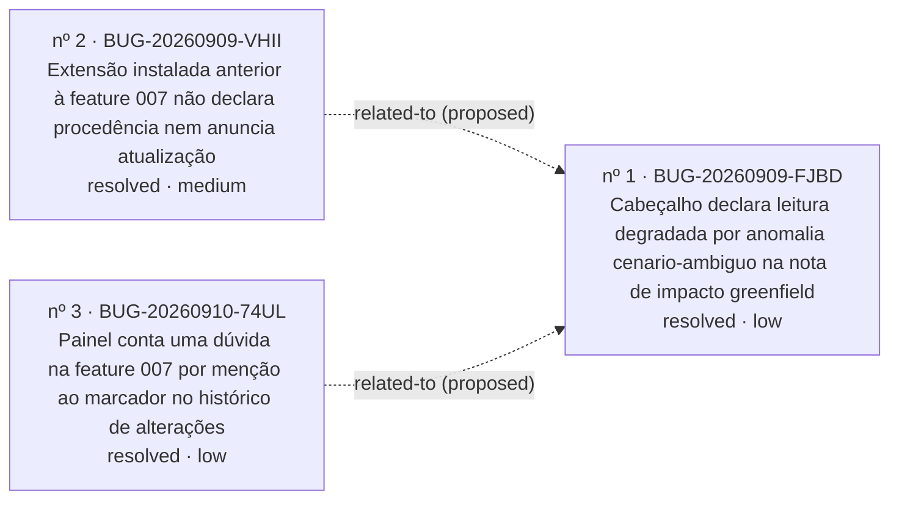

<!-- GENERATED, DO NOT EDIT: regenerado por /reversa-debugger-graph em 2026-09-10T11:34:13.415Z a partir de 3 bugs -->
# Grafo de bugs · painel-do-processo

## Clusters

- `leitura-do-processo`: 2 bug(s): BUG-20260909-FJBD, BUG-20260910-74UL
- `empacotamento-e-verificacao`: 1 bug(s): BUG-20260909-VHII

Nenhum cluster por causa estrutural: não há aresta `supported` ou `confirmed` entre os bugs deste contexto.

## Impact score (heurística de triagem; não substitui priority/severity)

| Bug | Score |
|---|---|

Fórmula: causados×3 + bloqueados×2 + regressões×4 + relacionados×1 (máx. 3), só sobre arestas `supported`/`confirmed`.
