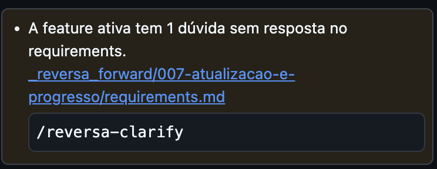
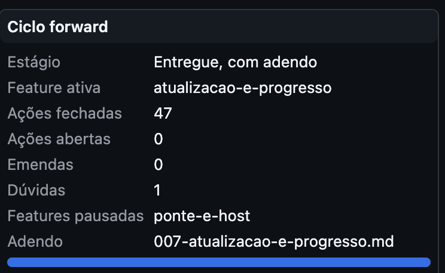

# Relato de intake: 2026-09-09 21:51 (Brasília)

**Contexto:** `painel-do-processo` (criado neste relato).
**Origem:** relato manual no chat, via `/reversa-debugger`, com uma captura de tela do painel.
**Modo da sessão:** sem interlocutor durante a execução; o usuário fixou em seguida o objetivo
"corrigir os bugs". As perguntas de intake que o fluxo prevê (esperado vs observado, frequência,
severidade e prioridade) foram respondidas pela investigação e ficam marcadas como assumidas.

## Palavras do usuário

> há um bug que está aparecendo uma dúvida . e não apareceu nada para atualizar o reversa-viewr

Anexo: uma captura do painel, transcrita em `captura-2026-09-09-1936.md`.

## Leitura do relato

A frase contém dois problemas, e a captura confirma os dois:

### Problema 1: "está aparecendo uma dúvida"

Lido como a faixa âmbar do cabeçalho, "Leitura degradada: 1 anomalias, 0 recusas, 0
truncamentos", que é o único elemento da captura que levanta uma dúvida sem dizer qual. O
usuário não abriu a seção de anomalias; o registrador reproduziu a leitura fora do editor
(`leitura-anomalias-2026-09-09-2151.txt`):

- Arquivo: `legacy-impact.md` da feature ativa (hoje a 007; às 19:36, a 006).
- Código: `cenario-ambiguo`. Detalhe: "nota de greenfield com impacto que não é componente-novo".
- Origem da regra: o leitor herdado `src/heranca/reversa-domain/src/impact.ts`, linha 111, que
  segue a regra do framework (`reversa-coding/SKILL.md`, linha 101: em greenfield, tudo é
  `componente-novo`). As notas das features 006 e 007 usam de propósito `regra-nova`,
  `regra-alterada`, `delta-de-dados` e `delta-de-contrato-externo`, e dizem por quê no próprio
  cabeçalho ("um rastro que chamasse de novo um arquivo que já existia mentiria").
- Esperado (assumido): a leitura de um processo íntegro não é anunciada como degradada. Observado:
  o cabeçalho anuncia degradação enquanto a feature ativa tiver nota de impacto nessa forma, isto
  é, em toda leitura desde a feature 006.
- Frequência: determinística, em toda leitura.

### Problema 2: "não apareceu nada para atualizar o reversa-viewer"

A feature 007 entregou o anúncio de atualização no cabeçalho e os itens de procedência. A captura
não mostra nenhum dos três, e a investigação explica (`extensao-instalada-2026-09-09.txt`,
`git-cronologia-2026-09-09.txt`):

- A extensão instalada é a `0.0.1`, instalada às 19:31, antes do commit da feature 007 (21:43).
  O pacote instalado não contém `out/host/update.js`, `net.js` nem `build.js`, e nenhuma
  ocorrência de `setUpdate`.
- A raiz do clone tem dois pacotes: `reversa-views-0.0.1.vsix` (19:31, o instalado) e
  `reversa-views-0.6.1.vsix` (21:29, construído de `a23711d` com o código da 007 ainda não
  commitado; contém `update.js`, `net.js` e `build.js`). O segundo nunca foi instalado. Nenhum
  pacote foi gerado do commit da feature (`543f0bd`, que derivaria `0.7.0`).
- O clone está em dia com a origem (HEAD igual a `origin/master`), e a origem responde à consulta
  anônima que o painel novo faria (`origem-compare-2026-09-09.json`: HTTP 200, `identical`).
- Esperado: o painel diz se a construção está atrás e mostra versão e commit. Observado: a
  construção instalada é anterior à capacidade de anunciar, e nada no produto avisa disso. É o
  caso de bootstrap que a feature não cobriu: uma instalação anterior à 0.7 só se atualiza por
  gesto manual (construir, empacotar, instalar), e ninguém a avisa.
- Frequência: determinística enquanto a 0.0.1 estiver instalada.

## Observação do registrador, fora do relato

"1 anomalias": a frase de integridade não flexiona o número. Não registrada como bug; anotada em
Agent Notes do problema 1 para registro futuro, se o usuário quiser.

## Severidade e prioridade (assumidas, sem resposta do usuário)

| Problema                        | Severidade | Prioridade | Razão                                                                                                                    |
| ------------------------------- | ---------- | ---------- | ------------------------------------------------------------------------------------------------------------------------- |
| 1, anomalia`cenario-ambiguo`  | low        | P2         | A leitura é completa; o dano é uma dúvida permanente no cabeçalho, que desgasta o sinal de degradação               |
| 2, instalação anterior à 007 | medium     | P1         | Anula o objetivo da feature 007 para quem já tinha a extensão; a persona primária não tem como saber que ficou atrás |

## Bugs registrados a partir deste relato

- Problema 1: `BUG-20260909-FJBD` (nº 1)
- Problema 2: `BUG-20260909-VHII` (nº 2)

---

Ainda aparece 

como se houvesse uma dúvida a ser respondida para o reversa clarify. Como na imagem acima.

## Esclarecimento do usuário (2026-09-10) e correção de leitura

As duas imagens acima mostram o painel já na 0.7.0 (47 ações, barra de progresso, adendo da 007):
o problema 2 saiu da tela. E mostram o que "uma dúvida" queria dizer: o cartão do ciclo forward
com **Dúvidas: 1** e a faixa de bloqueio "A feature ativa tem 1 dúvida sem resposta no
requirements", com o comando `/reversa-clarify`.

O registrador havia lido "dúvida" como a faixa de leitura degradada (problema 1, `BUG-20260909-FJBD`).
Aquele registro continua válido como problema observado, mas não era o apontado. O apontado é:

### Problema 3: "Dúvidas: 1" sem dúvida aberta

- `countDoubts`, no leitor herdado (`actions.ts`, R10), conta toda ocorrência literal de `[DÚVIDA]`
  no `requirements.md` da feature ativa.
- O requirements da 007 diz, na seção 10, "Nenhuma lacuna aberta. As três dúvidas da versão inicial
  foram resolvidas". A única ocorrência do marcador está na linha 407, no histórico de alterações:
  "três `[DÚVIDA]` resolvidos". É menção ao marcador, contada como dúvida.
- Esperado: "Dúvidas: 0", sem faixa. Observado: 1 e a faixa, em toda leitura da 007.
- Registrado como `BUG-20260910-74UL` (nº 3); severidade low e prioridade P2, assumidas.
